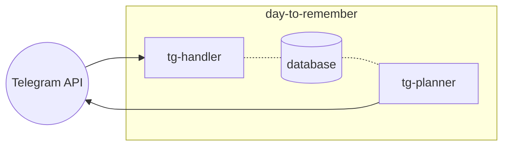

# Day to Remember



## Repo structure

```
# Пример объединения DDD + Hexagonal
src/
├── domain/           # Чистая бизнес-логика (DDD)
│   ├── order.py      # Агрегаты, entities, value objects
│   ├── services.py   # Domain services
│   └── events.py     # Domain events
├── application/      # Use cases, orchestration
│   └── use_cases/
│       └── place_order.py
├── infrastructure/   # Реализации репозиториев, внешние API
│   ├── repositories/
│   │   └── postgres_order_repo.py
│   └── api_clients/
│       └── payment_gateway_client.py
└── presentation/     # Controllers, API endpoints
    └── api/
        └── order_controller.py
```
