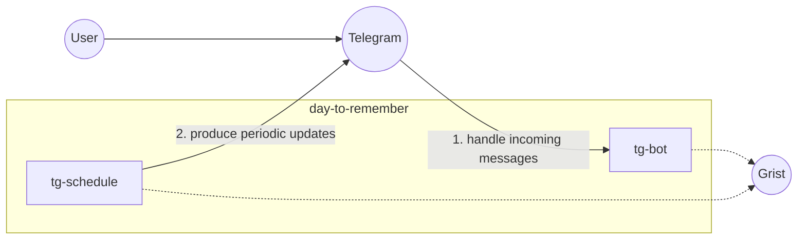

# Day to Remember

```mermaid
graph LR
  user((User))
  telegram((Telegram))
  grist((Grist))

  subgraph day-to-remember
    tg-schedule
    tg-bot
  end

  telegram -->|1. handle incoming messages| tg-bot
  tg-bot -.-> grist

  tg-schedule -->|2. produce periodic updates| telegram
  tg-schedule -.-> grist

  user --> telegram
```
