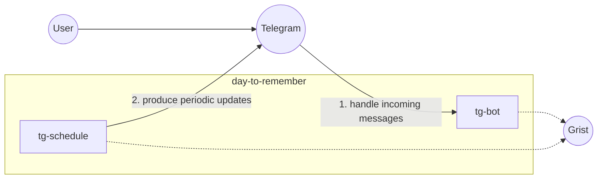

# Day to Remember

A Telegram bot application designed to help users log and review their daily achievements and important life moments. This system encourages consistent reflection and documentation of meaningful experiences.

## Overview

Day to Remember is a personal memory assistant that helps users:
- Document daily accomplishments and significant events
- Reflect on their progress over time
- Identify and prioritize their most meaningful experiences
- Build a repository of memorable moments through structured logging

## System Architecture



## Key Features

### 1. Daily Fact Logging
- Users can log daily facts by replying to bot messages
- Use "#day" hashtag in replies to trigger fact creation
- Simple and intuitive interface for documenting experiences

### 2. Periodic Reminders
- **Daily**: 8:00 PM reminder to share today's fact
- **Weekly**: Monday 8:05 PM reminder to choose most important facts from the week
- Customizable scheduling for different user needs

### 3. User Management
- Automatic user registration upon first interaction
- Persistent user data storage in Grist
- Telegram ID tracking for communication

### 4. Fact Review System
- Weekly selection of most impactful facts
- Historical review of documented experiences
- Progress tracking over time

## Technical Implementation

### Core Components
- **Telegram Integration**: Uses PyTelegramBotAPI for bot functionality
- **Data Persistence**: Grist API for robust data storage and retrieval
- **Scheduling**: Python schedule library for periodic task execution
- **Clean Architecture**: Separation of concerns with use cases, repositories, and adapters

### Data Flow
1. User interacts with Telegram bot
2. Bot processes messages and triggers appropriate use cases
3. Use cases interact with repositories for data access
4. Repositories communicate with Grist adapter for data persistence
5. Scheduled tasks trigger periodic notifications

## Getting Started

### Prerequisites
- Python 3.13+
- Telegram bot token
- Grist API credentials

### Environment Setup

Those params should be placed to `.env` file:

```bash
# Set required environment variables
export TG_TOKEN="your_telegram_bot_token"
export GRIST_URL="your_grist_api_url"
export GRIST_DOC_ID="your_grist_document_id"
export GRIST_TOKEN="your_grist_api_token"
export DEV_RUN="no"  # Set to "yes" for development mode
```

```bash
# Build base image
docker build . --progress=plain -f Dockerfile -t local/dev
```

### Running the Application
```bash
# Start the main bot
docker run --rm -ti --env-file=.env local/dev uv run tg_bot.py

# Start the scheduler for periodic tasks
docker run --rm -ti --env-file=.env local/dev uv run tg_schedule.py
```

## Usage Patterns

### Starting the Bot
1. Send `/start` command to the Telegram bot
2. Bot registers user and begins interaction

### Logging Facts
1. Receive daily reminder message from bot
2. Reply to the message with your fact

### Weekly Review
1. Receive weekly reminder on Monday
2. Choose most important facts from the past week
3. System saves your selections for future reference

## Project Structure

```
day-to-remember/
├── tg_bot.py              # Main Telegram bot handler
├── tg_schedule.py         # Scheduled tasks for periodic reminders
├── app/                   # Application core
│   ├── use_cases/         # Business logic handlers
│   ├── infrastructure/    # Data access and external adapters
│   ├── domain/            # Core domain models
│   └── dto/               # Data transfer objects
├── Dockerfile             # Container configuration
├── pyproject.toml         # Dependencies and project configuration
└── README.md              # This file
```

## Benefits

- **Consistent Documentation**: Encourages regular logging of important moments
- **Reflection Practice**: Prompts users to think about their experiences and progress
- **Memory Preservation**: Builds a repository of meaningful experiences over time
- **Personal Growth**: Helps identify patterns and achievements in daily life
- **Low Cognitive Load**: Simple interface with minimal friction for logging

## Contributing

This project welcomes contributions. Please follow these steps:
1. Fork the repository
2. Create a feature branch
3. Commit your changes
4. Push to the branch
5. Create a Pull Request

## License

This project is licensed under the WTFPL.
